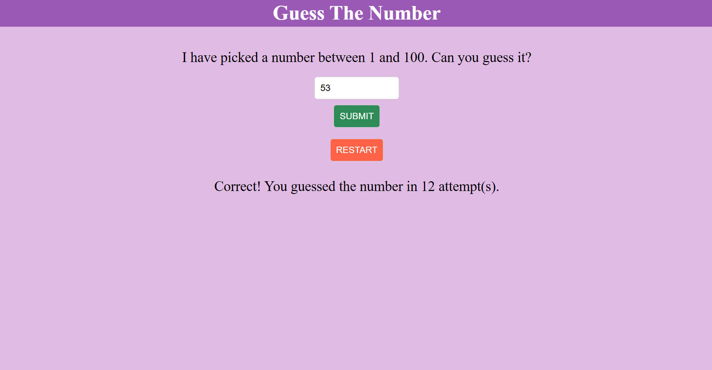

# GuessTheNumber
A simple number guessing game where the player has to guess a number between 1 and 100, with feedback provided after each guess and the goal is to guess the correct number in the fewest attempts possible!

Features

A clean and responsive user interface.
Provides feedback on each guess (e.g., higher, lower, or correct).
Tracks and displays the number of attempts.
Includes a restart button to reset the game.

How to Play

The game generates a random number between 1 and 100.
Enter your guess in the input field.
Click the "Submit" button.
If your guess is too high or too low, you'll get a hint.
If your guess is correct, you'll see a success message along with the number of attempts.
Click the "Restart" button to play again.

🎮 Demo

Below is a snapshot of the Guess The Number Game in action:

